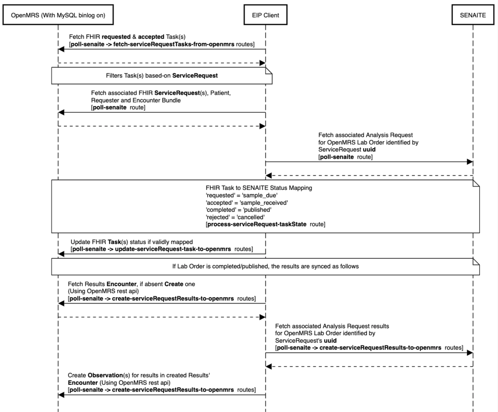

------

# EIP Routes SENAITE

## a) Run OpenMRS on port 8080 and MySQL on port 3306

Follow instructions here: https://github.com/openmrs/openmrs-distro-referenceapplication/tree/3.x

#### Enable mysql bin log
If using Docker Compose, expose the `port` and override the `command` parameters in **docker-compose.yml**. For example:

```
    ports:
      - 3306:3306
    command: "mysqld --character-set-server=utf8 --collation-server=utf8_general_ci --log-bin --binlog-format=ROW"
    
```


## b) Run SENAITE on port 8088

```
git clone https://github.com/senaite/senaite.docker
cd senaite.docker
docker build -t senaite .
docker run --rm --name senaite -p 8088:8080 senaite
```
Access http://localhost:8088/
and follow the steps to "Install SENAITE"

user/password `admin/admin`


## c) How to use the routes

Follow the instructions here: https://github.com/mekomsolutions/eip-client

#### Note
Remember to provide an `application.properties` file defining the required runtime properties needed by the routes. Use this [template file](src/test/resources/application.properties). Uncomment the properties prefixed with `##` and set them appropriately.

## d) Workflows

Below are sequence diagrams showing a quick overview of what the routes do.

#### 1) Placing lab orders


#### 2) Deleting, Voiding and Canceling/Discontinuing lab orders


#### 3) Renewing, Revising lab orders


#### 4) Updating and Fulfilling lab orders


